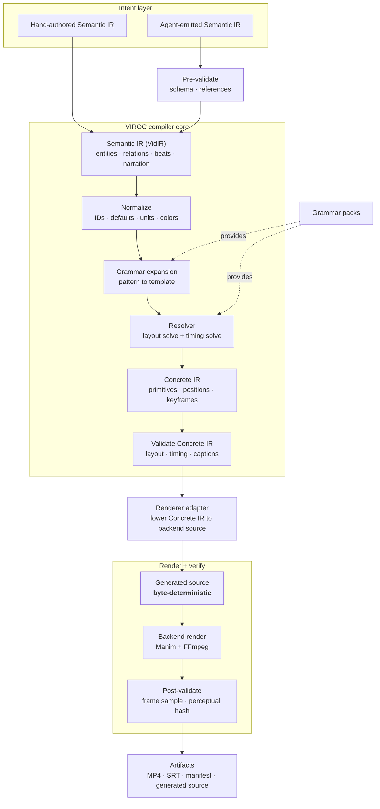
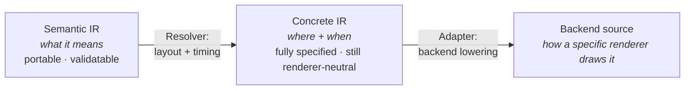
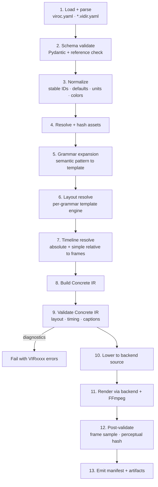
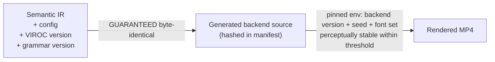
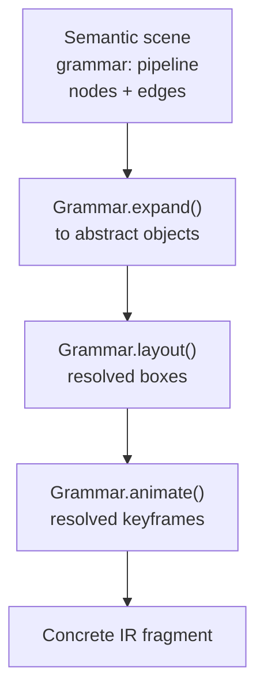
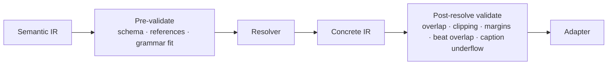
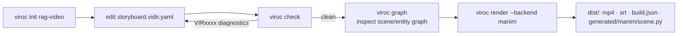
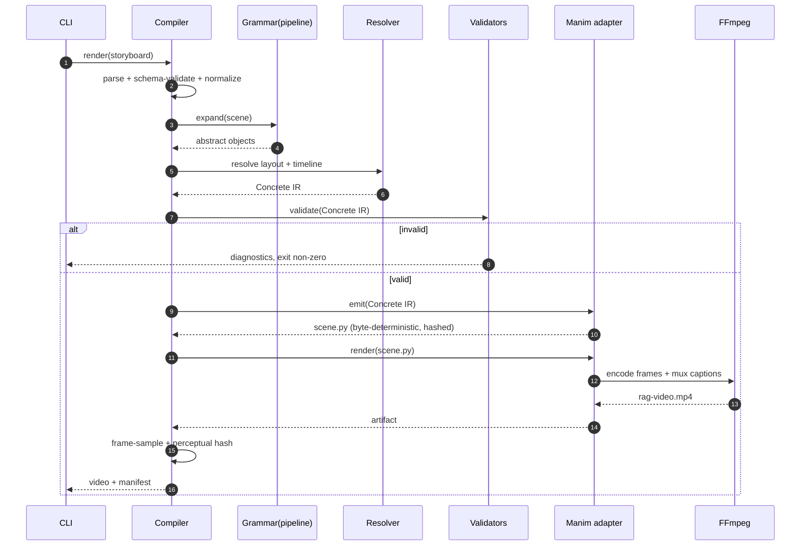
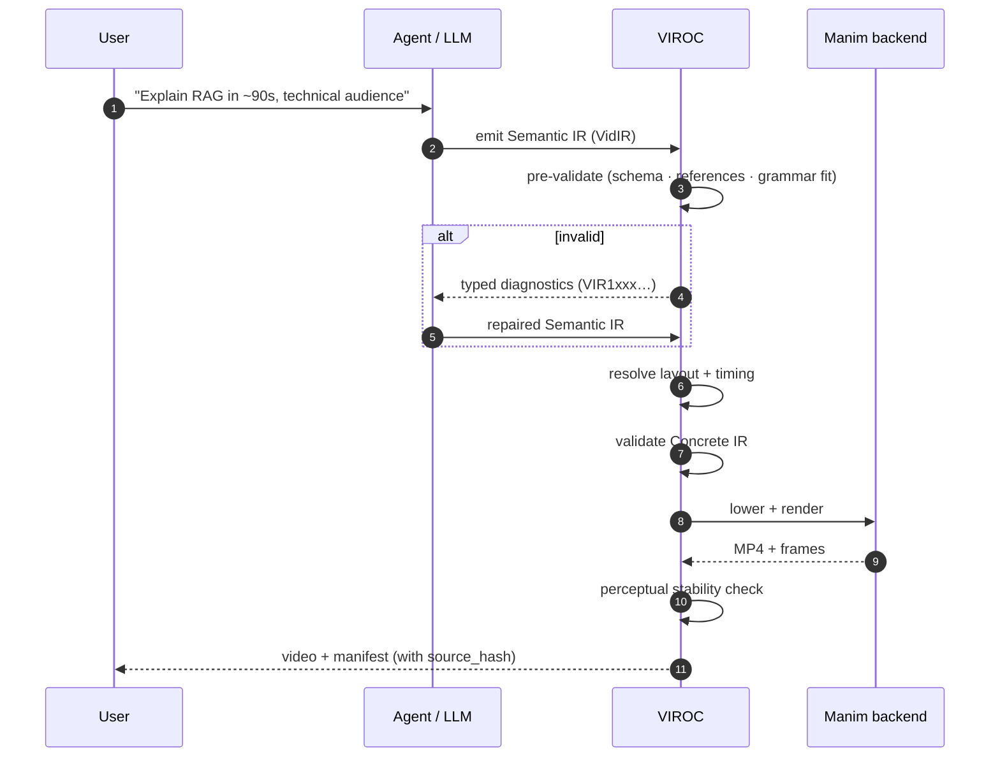

# VIROC — System Design

This document specifies the architecture, the two-level IR, the compiler pipeline, the renderer-adapter contract, the validation system, and the user/system/agent workflows. It assumes the reframing in the System Overview: VIROC is a *verifiable intermediate layer*, the moat is grammars + adapters + validation, and determinism is guaranteed only on the compile.

---

## 1. Architecture



**Boundaries that matter:**

- The **Semantic IR** is the only thing humans and agents touch. It is portable across backends.
- The **Resolver** is the hard subsystem (layout + timing). It consumes Semantic IR + the active grammar and produces fully-specified Concrete IR.
- The **adapter** is the only renderer-specific code. Swapping backends swaps adapters, not the IR.
- Everything left of "Render" is a **pure function** — the determinism guarantee lives here.

---

## 2. The two-level IR

### 2.1 Why two levels

One IR cannot be both renderer-neutral (portable) and fully specified (good-looking) without contradiction. Splitting them turns the contradiction into a lowering step:



### 2.2 Semantic IR (Pydantic sketch)

Models are Pydantic v2, composition over inheritance, no behaviour on the data classes.

```python
from typing import Literal
from pydantic import BaseModel, Field

EntityType = Literal["data_source", "intermediate", "model", "storage", "service", "user"]
EdgeKind = Literal["flow", "split", "transform", "store", "merge", "compare"]

class Entity(BaseModel):
    id: str
    label: str
    type: EntityType

class Edge(BaseModel):
    from_: str = Field(alias="from")
    to: str
    kind: EdgeKind = "flow"

class Beat(BaseModel):
    id: str
    at: str                      # absolute "4s" or relative "after(prev.end)"
    duration: str
    narration: str | None = None

class Scene(BaseModel):
    id: str
    grammar: str                 # e.g. "pipeline" — selects layout/animation template
    duration: str
    nodes: list[str] = []        # entity ids
    edges: list[Edge] = []
    beats: list[Beat] = []
    narration: str | None = None

class VideoMeta(BaseModel):
    id: str
    title: str
    fps: int = 30
    resolution: tuple[int, int] = (1920, 1080)
    duration_target: int | None = None

class SemanticIR(BaseModel):
    vidir_version: str
    video: VideoMeta
    entities: list[Entity]
    scenes: list[Scene]
```

### 2.3 Concrete IR (sketch)

The Resolver output: every object has a resolved box and every animation a resolved time window. Still renderer-neutral (no Manim/React types), but nothing is left to the adapter's judgment except *drawing*.

```python
class Box(BaseModel):
    x: float; y: float; w: float; h: float   # logical units, origin top-left

class ResolvedObject(BaseModel):
    id: str
    primitive: Literal["text", "rect", "icon", "arrow", "code", "formula"]
    box: Box
    z: int = 0
    style_ref: str

class Keyframe(BaseModel):
    object_id: str
    kind: Literal["fade_in", "draw", "move", "highlight", "fade_out"]
    start_f: int                 # resolved to frames
    end_f: int
    easing: Literal["linear", "ease_in_out", "spring"]

class ConcreteIR(BaseModel):
    fps: int
    resolution: tuple[int, int]
    objects: list[ResolvedObject]
    keyframes: list[Keyframe]
    captions: list["Caption"]
```

The adapter's job is now mechanical: map each `ResolvedObject`/`Keyframe` to backend draw calls. No layout decisions remain at the adapter.

---

## 3. Compiler pipeline



Phases 1–10 are pure and byte-deterministic. Phases 11–12 are the only environment-dependent steps, and they are verified perceptually, never bit-exact.

### 3.1 Determinism contract



What this buys: `source_hash` in the manifest is a true reproducibility key. Two machines with the same VIROC version produce identical Manim source; if their renders diverge, the divergence is provably in the environment, not the compile.

---

## 4. Grammar system

A grammar is a plugin that owns three things for one semantic pattern:

1. **Expansion** — semantic nodes/edges → a set of abstract objects (a `pipeline` becomes node-boxes + connecting arrows + labels).
2. **Layout template** — places those objects without overlap, with balance, for *this* pattern. Template-driven, not a general solver.
3. **Animation template** — default entrance/transform/exit choreography for the pattern.



**Why grammars are template-per-pattern, not a global constraint solver:** general graph layout that *looks good* is research-grade and open-ended. Per-pattern templates are tractable, and they make the grammar the unit of accumulating value. v1 ships exactly one: `pipeline`.

---

## 5. Renderer adapter contract

Adapters are compiler backends. The contract is intentionally narrow — adapters consume Concrete IR and emit source; they make no layout or timing decisions.

```python
from typing import Protocol
from viroc.ir import ConcreteIR
from viroc.core import BuildContext, BuildArtifact, Diagnostic

class RendererAdapter(Protocol):
    id: str
    version: str
    capabilities: frozenset[str]          # e.g. {"text","arrow","formula","camera"}

    def check_environment(self, ctx: BuildContext) -> list[Diagnostic]: ...

    def supports(self, ir: ConcreteIR) -> list[Diagnostic]:
        """Return diagnostics for any primitive/animation this backend can't render."""
        ...

    def emit(self, ir: ConcreteIR, ctx: BuildContext) -> BuildArtifact:
        """Pure: Concrete IR -> backend source. MUST be byte-deterministic."""
        ...

    def render(self, source: BuildArtifact, ctx: BuildContext) -> BuildArtifact:
        """Impure: invoke backend + FFmpeg. Environment-dependent."""
        ...
```

### 5.1 Capability negotiation

If a Concrete IR uses a primitive the backend lacks, the compiler fails with a precise diagnostic rather than rendering something wrong:

```text
error[VIR5031]: renderer "manim" does not support primitive "html_embed"
help: use renderer "html", or provide a fallback image asset for object "demo_panel"
```

### 5.2 Diagnostic code ranges

| Range | Class |
|---|---|
| VIR1xxx | schema / references |
| VIR2xxx | timing |
| VIR3xxx | layout |
| VIR4xxx | assets |
| VIR5xxx | renderer compatibility |
| VIR7xxx | reproducibility |

(Semantic-consistency `VIR6xxx` and output-validation `VIR8xxx` are reserved but unimplemented in v1.)

---

## 6. Validation system

Two validation points, two purposes:



- **Pre-validate** runs on the Semantic IR — cheap, catches authoring errors before any layout work.
- **Post-resolve validate** runs on the Concrete IR — this is where layout/timing checks become possible, because positions and frame windows now exist.

Validation asserts *necessary* conditions only. It never claims the video is a good explanation; that judgment stays with the author.

---

## 7. Package structure (v1)

Cut from the draft's ~12 packages + studio to the minimum that ships the spine.

```text
viroc/
  pyproject.toml            # uv, ruff, pyright, pytest
  README.md
  docs/
    architecture.md
    vidir-spec.md
    grammar-authoring.md
    adr/
      0001-two-level-ir.md
      0002-determinism-boundary.md
      0003-template-per-grammar-layout.md
  examples/
    rag-pipeline/
      storyboard.vidir.yaml
      assets/
      expected/             # golden generated-source hash + perceptual baseline
  src/viroc/
    core/                   # ids, hashing, diagnostics, build context
    ir/                     # semantic.py, concrete.py, io (yaml/json)
    compiler/               # pipeline, normalize, resolve_layout, resolve_time, lower
    grammars/
      pipeline/             # expand.py, layout.py, animate.py  <-- the one v1 grammar
    adapters/
      manim/                # emit.py (pure), render.py (impure), templates/
    validators/             # schema.py, layout.py, timing.py
    cli/                    # init, check, compile, render, graph, doctor
  tests/
    unit/ integration/ golden/
```

Deferred (named, not built): `grammars/architecture`, `adapters/html`, `viroc.ai` (planning/ingest), `studio/`, `diff`.

---

## 8. Workflows

### 8.1 Manual authoring (the v1 happy path)



### 8.2 System workflow (what `render` does internally)



### 8.3 Agent workflow (the verifiable-target story)

This is the differentiating path: an LLM emits the Semantic IR, and VIROC's validation is what makes that output *trustworthy enough to render*.



The agent never touches pixels or backend code. Its output is a constrained artifact that VIROC can *check and repair* — which is precisely what raw code-generation cannot offer.

---

## 9. Key design principles

1. **Two IR levels, one lowering.** Portability above, fidelity below.
2. **Guarantee only what you control.** Byte-deterministic compile; perceptual render.
3. **Validation is the product.** Necessary-condition checks the IR makes possible.
4. **Grammars carry taste.** Layout is template-per-grammar, not a global solver.
5. **Adapters only draw.** No layout/timing decisions leak into backends.
6. **Agent output is a first-class input,** made safe by pre-validation + repair loop.
7. **Source-control native.** Readable IR, hashed source, diffable manifests.
8. **One excellent backend before many weak ones.** Manim, fully, first.

---

## 10. Open design questions (to resolve during the bake-off)

- **Layout expressiveness:** can a `pipeline` template cover the five v1 examples without per-example special-casing? If not, the template-per-grammar bet needs revisiting.
- **Relative-time minimal set:** is `after(x.end)` + fixed offsets enough for v1, or does even the pipeline grammar force a constraint solver earlier than planned?
- **Adapter determinism:** does Manim source emission stay byte-stable once LaTeX/text measurement enters the emit path, or does measurement leak environment state into the "pure" stage? (If it does, push measurement into the Resolver and keep emit pure.)
- **Caption timing source of truth:** narration-driven (TTS durations) vs. authored durations. v1 should pick authored durations to keep compile pure; TTS belongs to a later impure stage.
