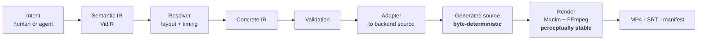
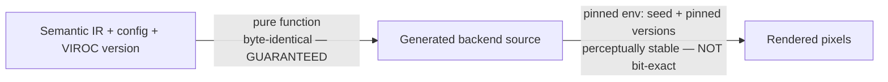

# VIROC — System Overview

> **VIROC** is a typed, verifiable intermediate layer between *intent* (a human or an LLM agent) and *rendered technical video*. It exists so that the plan for a video can be validated before a single frame is rendered, then compiled deterministically into the source code of an existing animation backend.

**Status:** pre-build vision. The project is gated on a one-week falsification experiment (§7) before any compiler code is written.

---

## 1. What it is

VIROC takes a structured storyboard — a typed **Semantic IR** called **VidIR** — and compiles it through three stages: a layout/timing **Resolver**, a **validation** pass, and a renderer **adapter** that emits backend source code (Manim first). The renderer produces the actual pixels.

The primary artifact is not the video. It is the **typed, diffable, validatable storyboard**. The video is a build output.



### What it is not

- Not a renderer. Manim, Remotion, and Motion Canvas are *targets*, not competitors.
- Not a text-to-video model. Sora/Runway generate pixels from prompts; VIROC generates a verifiable plan, then a deterministic render.
- Not "another way to write Manim." The whole point is a renderer-neutral semantic layer *above* any single backend's API.
- Not a UI/editor product. A visual layer is explicitly out of scope until the compiler is proven.

---

## 2. Why — the problem and why now

**The problem.** Technical video (architecture explainers, ML concept walkthroughs, algorithm animations, paper summaries) is expensive to produce and impossible to maintain. When the system you're explaining changes, the video is dead — there is no source of truth to diff, validate, or re-render. Every existing path forces a choice between *control without structure* (write raw Manim/React) and *structure without control* (black-box generation).

**Why now.** Two things shifted in 2025–2026:

1. **Agents can emit structured artifacts reliably.** An LLM can now produce a typed storyboard far more reliably than a polished video. This makes a typed IR a *natural agent target*, not a burden.
2. **The programmatic-video field has converged on "generate an inspectable intermediate, then render."** Remotion shipped agent-driven generation (Remotion Skills, Jan 2026), and its own positioning argues that generating an intermediate code artifact is more controllable than asking a model to emit final video directly. Revideo folded into Midrender, a visual editor that speaks MCP to Claude Code and Cursor.

That convergence is the opportunity *and* the threat. The market agrees an intermediate artifact is the right idea. VIROC's bet is narrower and sharper: **the intermediate should be a typed, renderer-neutral semantic IR that can be mechanically validated — not Turing-complete framework code that cannot.**

**The gap.** Remotion's intermediate is React/TypeScript. You can read it, but you cannot mechanically prove a beat's caption fits its duration, that no two nodes overlap, that every referenced entity is defined, or that the same storyboard would render on a different backend. Framework code has full latitude, which is exactly what makes it unverifiable. A constrained semantic IR trades expressiveness for *checkability* — and for technical diagrams, checkability is worth more than expressiveness.

---

## 3. How it works

### 3.1 A two-level IR (the central design decision)

A single "renderer-neutral IR that also produces good-looking video" is a contradiction — too abstract and every adapter reinvents the look; too concrete and it leaks renderer assumptions. VIROC resolves this the way MLIR does, with **two IR levels and an explicit lowering between them**:

| Level | Holds | Who writes it | Property |
|---|---|---|---|
| **Semantic IR** | entities, relations, beats, narration, intent | humans or agents | portable, diffable, validatable |
| *Resolver* | layout solve + timing solve | the compiler (per-grammar) | where the hard work lives |
| **Concrete IR** | resolved primitives, positions, keyframes | the compiler | renderer-neutral but fully specified |
| *Adapter* | lower Concrete IR → backend source | per-backend | the fidelity layer |

Portability lives at the Semantic IR. Visual fidelity lives below the Concrete IR. The contradiction becomes a *designed boundary*.

### 3.2 Determinism, scoped honestly

The draft's claim "same inputs = same output" is only true if the backend is bit-deterministic, and Manim is not across environments (LaTeX/dvisvgm, fonts, Cairo, FFmpeg all vary by version and platform; Manim offers a `--seed` but no cross-environment frame guarantee). So VIROC splits the guarantee at the boundary it actually controls:



- **Compile is byte-deterministic** — this is VIROC's code, a pure function, and the real guarantee.
- **Render is perceptually stable** within a pinned environment — verified by perceptual hashing, never frame-exact equality (frame-exact `diff` produces false positives from encoder jitter and is cut from v1).

This reframes determinism's *purpose*: it makes agent output **verifiable and reproducible**, not bitwise-identical pixels.

### 3.3 Validation is the product, not a feature

Because the Semantic IR is constrained and typed, VIROC can run checks that framework code cannot:

| Class | Examples |
|---|---|
| Schema | unknown fields, missing IDs, undefined entity references |
| Layout | node overlap, text clipping, unsafe margins (on Concrete IR) |
| Timing | overlapping beats, impossible durations, caption underflow |
| Reproducibility | version lock, asset hash, source hash |

Validation checks *necessary* conditions (the video isn't broken), never *sufficient* ones (the video teaches well). VIROC does not claim to judge explanatory quality — that remains human.

### 3.4 Grammars carry the domain knowledge

A **grammar** maps a semantic pattern (e.g. `pipeline`, `architecture`) to a layout + animation template that reads well. Grammars are where "we know how to make a RAG diagram look good" is encoded. v1 layout is **template-per-grammar**, not a general constraint solver — tractable, and it puts the accumulating value in the grammars.

---

## 4. Market research

### 4.1 The landscape (as of mid-2026)

| Tool | Model | License | Niche | Relation to VIROC |
|---|---|---|---|---|
| **Remotion** | React → MP4, headless Chrome | BUSL (paid >$1M ARR / 4+ employees) | data-driven, scaled, dev video | Candidate backend; closest competitor via *Remotion Skills* |
| **Motion Canvas** | TS generators, canvas | MIT | hand-crafted explainers | Candidate backend |
| **Revideo / Midrender** | Motion Canvas fork + visual editor | MIT | automated pipelines, MCP-driven | Backend + the agent-UI threat |
| **Manim** | Python, Cairo/OpenGL | MIT | math/technical animation | **v1 backend** |
| **Sora 2 / Runway** | diffusion / world models | proprietary | cinematic, photorealistic | Not a competitor; possible asset source |
| **Rive / Lottie** | runtime vector assets | OSS runtimes | UI/product animation | Possible asset import/export |

Download signal (per 2026 third-party package comparisons, approximate): Remotion ~60K weekly, Motion Canvas ~8K, Revideo ~3K. Remotion is the gravity well.

### 4.2 The real competitor is the agent + a backend

The sharpest baseline is not any single tool — it is **an LLM emitting Manim or Remotion code directly**, which shipped as a product (Remotion Skills) in January 2026. The honest comparison:

| | Agent → framework code (Remotion Skills) | Agent → VidIR → VIROC |
|---|---|---|
| Intermediate | React/TS — readable | typed semantic IR — readable **and checkable** |
| Pre-render validation | none | schema + layout + timing |
| Renderer portability | locked to React | retargetable (Manim, HTML, …) |
| Semantic diff | no | yes |
| Reproducibility | regenerate ≠ same | byte-deterministic compile |
| Expressiveness | full framework API | capped by IR |
| Build cost to get here | ~0 (model knows React) | high (IR + resolver + adapters + grammars) |

VIROC wins only if validation + portability + reproducibility outweigh the expressiveness loss **and** justify the build. That is an empirical claim, and it must be tested before committing (§7).

### 4.3 Demand signals

- Programmatic video is a live, growing category with multiple funded/active OSS projects converging on the agent-target pattern.
- Every one of those projects targets *general* video (ads, social, personalized marketing). None is purpose-built for **technical correctness** — typed entities, validated layouts, reproducible diagram videos. That is the unoccupied wedge.
- Documentation-as-code, diagrams-as-code (Mermaid, D2), and CI-rendered artifacts are normalized in engineering culture. "Video-as-code with validation" is the unfilled adjacent slot.

---

## 5. Risks

| # | Risk | Severity | Mitigation |
|---|---|---|---|
| 1 | **The IR isn't worth it** — a senior eng would rather edit raw Manim than VidIR | Existential | The §7 bake-off, before building anything |
| 2 | **Abstraction tension** — neutral IR can't also produce good video | High | Two-level IR; quality is the adapter+grammar's job, portability is the Semantic IR's |
| 3 | **Determinism is inherited** — weakest backend caps reproducibility | High | Guarantee only the compile; perceptual (not exact) render checks |
| 4 | **Layout is research-grade** and underweighted | High | Template-per-grammar in v1; no general solver |
| 5 | **Scope is multi-year for a solo dev** | High | Cut to one grammar + one backend + manual authoring (§6) |
| 6 | **Market timing** — Remotion/Midrender ship agent layers now | Medium | Don't compete on "inspectable intermediate"; compete on *typed + validated + domain-aware* |
| 7 | **Temporal constraint-solving** (semantic anchors, retiming) is a hidden solver | Medium | Deferred entirely from v1; absolute + simple relative time only |
| 8 | **Manim adapter fidelity** — abstract IR → good Manim is most of the work | Medium | Scope the v1 object set to what one grammar needs |

The top risk is #1, and it is cheap to test. Everything else is reprioritization.

---

## 6. v1 scope (deliberately small)

| In v1 | Cut from v1 |
|---|---|
| One grammar: `pipeline` | All other grammars |
| One backend: Manim | HTML, Remotion, static, everything else |
| Manual Semantic IR authoring | AI planning, ingest (docs/repo/paper) |
| Validation: schema + layout + timing | semantic/accessibility/regression validation |
| Time: absolute + simple relative | semantic anchors, retiming |
| Narration script + SRT captions | audio mixing, music, SFX |
| Build manifest + asset/source hashing | frame-exact `diff` |
| Perceptual stability check | visual regression suite |
| CLI: `init`, `check`, `compile`, `render`, `graph`, `doctor` | `plan`, `ingest`, `critique`, studio UI |

> Post-v1 (M17–M18): the guided authoring and review surfaces `ingest`, `plan`, and `critique` have since shipped on top of the v1 core. `critique` promotes the static-storyboard review surface into the default `ingest -> plan -> critique -> compile -> render` path (see the README guided flow). Studio UI remains out of scope.

**v1 success criterion:** given a hand-authored `pipeline` storyboard, VIROC validates it, compiles it to byte-deterministic Manim source, renders a clean 1080p video, and emits a manifest — and a senior engineer prefers editing the VidIR to editing the equivalent Manim.

---

## 7. The de-risking gate (do this first)

Before writing the compiler, build the **same five videos three ways**:

1. Hand-written Manim, LLM-assisted.
2. Remotion Skills (agent → React).
3. Mocked VidIR (Semantic IR by hand) + a throwaway lowering to Manim.

Then put them in front of 3–5 senior engineers and ask one question: **for editing, validating, and re-rendering, which intermediate do you want to live in?**

- If they pick raw Manim/React → the premise is wrong; stop. Cost: one week.
- If they pick VidIR → you have evidence the compiler is worth years.

This single experiment converts the project's biggest risk into a one-week measurement.

---

## 8. Possible moat

**Not the schema.** A schema is copyable in an afternoon; it is a coordination cost, not a moat.

The defensible, compounding assets, in order:

1. **Grammar packs** — encoded taste: "a RAG flow / a microservice topology / a BFS traversal looks *like this*." Irreproducible, accumulating, domain-specific.
2. **Adapter fidelity** — the craft of lowering abstract Concrete IR into Manim (then others) that actually looks good. Hard, slow, per-backend.
3. **The validation layer** — the verifiable-target capability that framework-code generators structurally cannot match.

Honest assessment: this is a *workflow + taste* moat, not a *technology* moat. It compounds with use and contribution (community grammars), and it is exactly the kind of moat an open-source toolchain can hold. The schema being open is a feature, not a leak.

**The stronger framing:** position VIROC as *the typed, verifiable target for AI-generated technical video* — "discern before you generate," applied to video. That makes validation central rather than decorative, and it aligns with where agent tooling is heading.

---

## 9. Examples

### 9.1 Semantic IR (what a human or agent writes)

```yaml
vidir_version: "0.1"
video:
  id: "rag-overview"
  title: "How Retrieval-Augmented Generation Works"
  resolution: { width: 1920, height: 1080 }
  fps: 30
  duration_target: 90

entities:
  - { id: documents, label: "Documents", type: data_source }
  - { id: chunks, label: "Chunks", type: intermediate }
  - { id: embedder, label: "Embedding Model", type: model }
  - { id: vector_db, label: "Vector DB", type: storage }
  - { id: llm, label: "LLM", type: model }

scenes:
  - id: pipeline
    grammar: pipeline           # <-- grammar carries the layout/animation
    duration: 35s
    nodes: [documents, chunks, embedder, vector_db]
    edges:
      - { from: documents, to: chunks, kind: split }
      - { from: chunks, to: embedder, kind: transform }
      - { from: embedder, to: vector_db, kind: store }
    narration: "Documents are chunked, embedded, and stored in a vector database."

validation:
  required_entities: [documents, chunks, embedder, vector_db, llm]
  checks: [schema, layout, timing]
```

The author declares *what* the scene means (`grammar: pipeline`, nodes, edges). They never specify pixel positions, easing curves, or Manim calls — the Resolver and adapter own that.

### 9.2 A diagnostic (compiler-grade, a signature feature)

```text
error[VIR1002]: unknown entity reference "vectorstore"
  ┌─ rag-overview.vidir.yaml:31:15
  │
31│     - from: vectorstore
  │             ^^^^^^^^^^^ not declared in entities
  │
help: did you mean "vector_db"?
```

### 9.3 Build manifest (provenance)

```json
{
  "project": "rag-overview",
  "viroc_version": "0.1.0",
  "vidir_version": "0.1",
  "source_hash": "sha256:…",          // hash of generated Manim source — byte-stable
  "asset_hashes": { "assets/doc.svg": "sha256:…" },
  "renderer": { "id": "manim", "version": "0.20.1" },
  "perceptual_hash": "phash:…",        // render stability, not bit-equality
  "duration_seconds": 91.4,
  "created_at": "2026-06-24T00:00:00Z"
}
```

### 9.4 Target v1 example set

`rag-pipeline`, `transformer-attention`, `ci-cd-pipeline`, `microservices-topology`, `algorithm-bfs` — all expressible by the single `pipeline` grammar plus minor variants, so v1 proves breadth of *content* without breadth of *machinery*.
